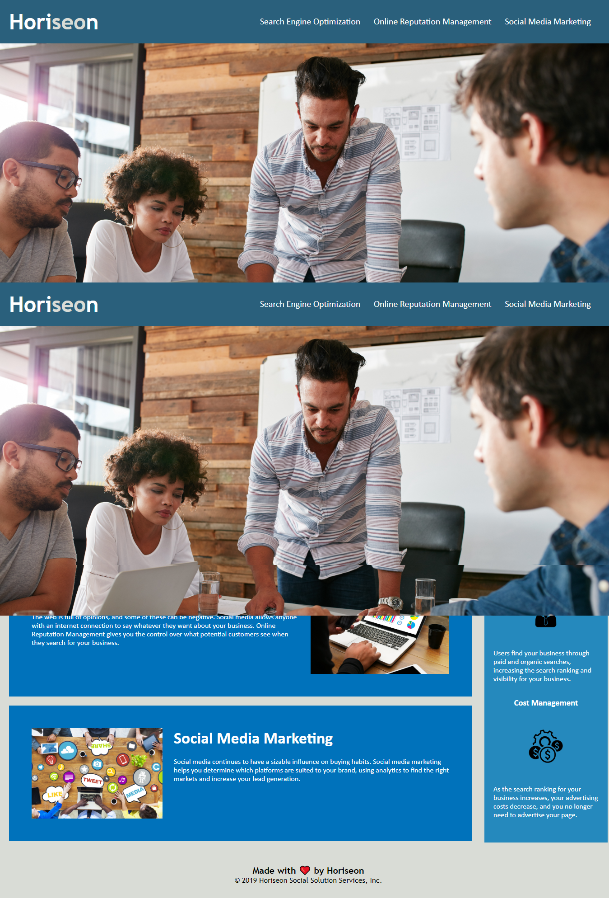

# Welcome to my README for the Week One Challenge! 
____

The website I worked on is called Horiseon. The challenge was to go through the working code and make it more easily accessible for persons with disabilities.

1. First I cloned the repososiorty from the bootcamp GitHub

## Here is the link to my working website!

https://cat-lin-morgan.github.io/horiseon/

## Here is my website screenshot!

