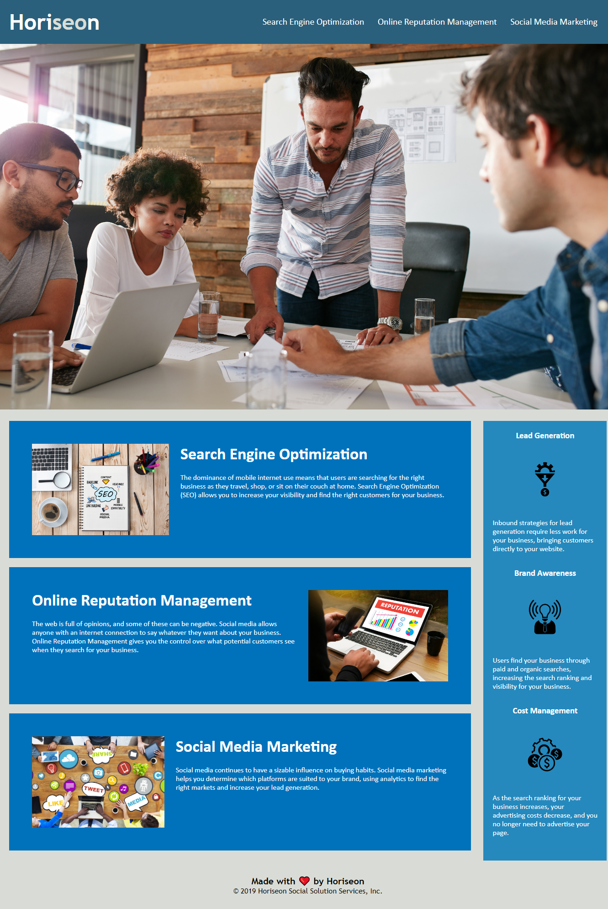

# Welcome to my README for the Week One Challenge! 

The website I worked on is called Horiseon. 
The challenge was to go through the working code and make it more easily accessible for persons with disabilities, and well as cleaning up the existing code.

I began by making a clone of the exiting repository from the bootcamp GitHub onto my local computer and looking at what needed to be done. I made note of issues on the webpage and issues existing in the html and css. I renamed the divs with class names, such as section, article, header, and footer to make it more easy for myself, future coders, the browser, and accessability tools to navigate. I went through to make sure both the css and html was cleaned up and had proper indentation. I made comments noting when each section began. Next I created my own repository for my code and pushed the code from my computer onto my GitHub. I then began writing this README. Next I'll submit this week's challenge.

## Here is the link to my working website!

https://cat-lin-morgan.github.io/horiseon/

## Here is my website screenshot!

**Thank you!**
